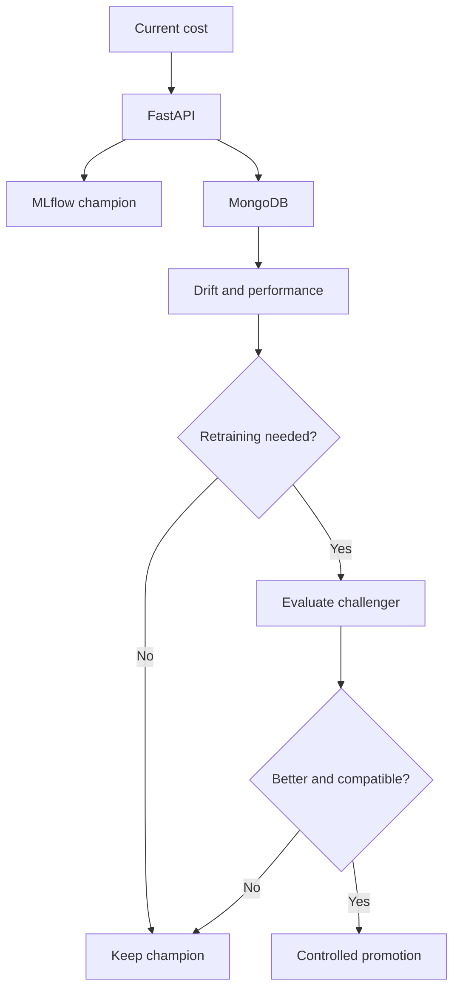

# FinOps Cloud Cost Forecasting MLOps System

A production-oriented MLOps system for forecasting next-hour cloud
cost, serving predictions through FastAPI, storing monitoring records
in MongoDB, detecting input drift, monitoring model performance, and
deciding when retraining is required.

## Production model

The production champion is a naive persistence baseline:

```text
predicted next-hour cost = current-hour estimated cost
```

It was selected because it achieved the lowest error on the
chronological test set.

| Model | Test MAE | Decision |
|---|---:|---|
| Persistence baseline | 7.8828 | Production champion |
| CatBoost | 8.5622 | Rejected |
| Other learned models | Higher than baseline | Rejected |

The baseline is packaged as an MLflow sklearn `LinearRegression` model
with coefficient `1` and intercept `0`.

- Registered model: `finops-cloud-cost-forecasting-clean-v1`
- Alias: `champion`
- Model version: `1`
- Input feature: `estimated_cost_index`
- Output: `predicted_next_hour_cost`
- Forecast horizon: `1_hour`

## System architecture



## Dataset strategy

- EA-Cost-FOCUS 1.0 provides financial cost information.
- Bitbrains GWA-T-12 provides workload and resource telemetry.
- Bitbrains telemetry is not treated as actual billing data.
- FOCUS and Bitbrains records are not arbitrarily joined row by row.
- NAB may be considered later for independent anomaly validation.

## API endpoints

| Method | Endpoint | Purpose |
|---|---|---|
| `GET` | `/` | Service information |
| `GET` | `/health` | Application and dependency health |
| `GET` | `/model-info` | Production model metadata |
| `POST` | `/predict` | Predict next-hour cloud cost |
| `POST` | `/actual` | Record an observed actual cost |
| `GET` | `/performance` | Calculate production performance |
| `GET` | `/drift` | Calculate PSI input drift |
| `GET` | `/retraining-status` | Produce a retraining recommendation |
| `POST` | `/v2/predict` | Optional telemetry-model endpoint |

The optional telemetry model is not currently deployed because the
previous CatBoost challenger did not beat the champion.

## Monitoring

### Data quality

Production input is validated using Pydantic and application-level
data-quality checks before inference.

### Input drift

Population Stability Index is calculated using recent
`estimated_cost_index` production values.

| PSI | Status |
|---:|---|
| Below `0.10` | Stable |
| `0.10` to below `0.25` | Moderate |
| `0.25` or higher | Significant |

At least 30 production values are required.

### Performance

Completed predictions are used to calculate:

- MAE
- RMSE
- Bias
- MAPE
- Degradation relative to the champion test MAE

At least 30 completed predictions are required for a stable or degraded
classification.

### Retraining decision

Retraining is recommended when:

- Significant input drift is detected, or
- Production model performance is degraded.

The `/retraining-status` endpoint is read-only. Model training and
promotion do not run inside the FastAPI request process.

## Repository structure

```text
api/
├── __init__.py
├── main.py
└── telemetry.py

artifacts/
└── retraining_jobs/

models/
└── champion/
    ├── conda.yaml
    ├── deployment_manifest.json
    ├── input_example.json
    ├── MLmodel
    ├── model.skops
    ├── python_env.yaml
    ├── reference_profile.json
    ├── registered_model_meta
    ├── requirements.txt
    ├── serving_input_example.json
    └── ...

notebooks/
├── 01_focus_eda.ipynb
├── 02_bitbrains_eda.ipynb
├── 03_feature_engineering.ipynb
├── 04_mlflow_experiment_tracking.ipynb
└── 05_fastapi_model_serving.ipynb

src/
├── billing/
│   ├── ingestion.py
│   └── provider_ingestion.py
├── monitoring/
│   ├── __init__.py
│   ├── anomaly.py
│   ├── data_quality.py
│   ├── drift.py
│   ├── explainability.py
│   ├── performance.py
│   └── storage.py
└── retraining/
    ├── __init__.py
    ├── candidates.py
    ├── contract.py
    ├── dataset.py
    ├── deployment.py
    ├── evaluation.py
    ├── inference.py
    ├── job.py
    ├── mlflow_logger.py
    ├── pipeline.py
    ├── registry.py
    ├── runner.py
    ├── scheduler.py
    └── trigger.py

streamlit_app.py

tests/
├── test_api.py
├── test_api_raw_hourly_input.py
├── test_billing_ingestion.py
├── test_billing_provider_ingestion.py
├── test_drift.py
├── test_monitoring_anomaly.py
├── test_monitoring_explainability.py
├── test_retraining_batch_two.py
├── test_retraining_candidates.py
├── test_retraining_dataset.py
├── test_retraining_evaluation.py
├── test_retraining_job.py
├── test_retraining_pipeline.py
├── test_retraining_registry.py
├── test_retraining_runner.py
├── test_retraining_trigger.py
├── test_telemetry_api.py
└── ...

.env
.env.example
Dockerfile
docker-compose.yml
LICENSE
README.md
requirements.txt


## Local setup

Create and activate a virtual environment:

```powershell
python -m venv venv
.\venv\Scripts\Activate.ps1
```

Install dependencies:

```powershell
python -m pip install -r requirements.txt
```

Run tests:

```powershell
python -m pytest -v
```

## Docker deployment

Create a `.env` file containing the MongoDB configuration:

```dotenv
MONGO_ROOT_USERNAME=finops_admin
MONGO_ROOT_PASSWORD=replace_with_secure_password
MONGODB_DATABASE=finops_monitoring
```

Build and start the services:

```powershell
docker compose up -d --build
```

Check the containers:

```powershell
docker compose ps
```

Open the API documentation:

```text
http://127.0.0.1:8000/docs
```

## Example prediction

```powershell
$body = @{
    estimated_cost_index = 24.397998
} | ConvertTo-Json

Invoke-RestMethod `
    -Method Post `
    -Uri "http://127.0.0.1:8000/predict" `
    -ContentType "application/json" `
    -Body $body |
    ConvertTo-Json -Depth 10
```

## Current implementation status

- Production champion deployed
- FastAPI prediction serving implemented
- MongoDB monitoring storage implemented
- Data-quality validation implemented
- PSI drift monitoring implemented
- Performance monitoring implemented
- Retraining decision logic implemented
- Challenger evaluation implemented
- Model-contract protection implemented
- Docker deployment implemented
- Automated tests implemented
- Automatic champion replacement intentionally protected

## Completed extension work

- Billing-history ingestion utilities exist for verified cost history and CSV loading.
- Anomaly detection now flags high-cost spikes with severity scoring.
- Explainability is available for learned models and explicitly rejected for the persistence baseline.
- A Streamlit dashboard has been added as a lightweight front-end for prediction, history, and monitoring views.

## Planned work

The remaining project work is operational hardening rather than core model development: production-grade ingestion automation, provider integration, and controlled retraining orchestration around the existing champion/challenger contract.